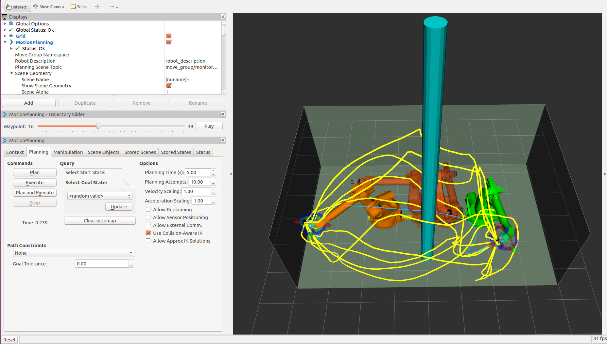

STOMP Planner
=============



Stochastic Trajectory Optimization for Motion Planning (STOMP) is a novel probabilistic optimization framework (Kalakrishnan et al. 2011). STOMP Produces smooth well behaved collision free paths within reasonable times. The approach relies on generating noisy trajectories to explore the space around an initial (possibly infeasible) trajectory which are then combined o produce an updated trajectory with lower cost. A cost function based on a combination of obstacle and smoothness cost is optimized in each iteration. No gradient information is required for the particular optimization algorithm that we use and so general costs for which derivatives may not be available (e.g. costs corresponding to constraints and motor torques) can be included in the cost function. Some of the strengths of STOMP include, it can incorporate additional objective functions such as torque limits, energy and tool constraints. Stomp can handle cost functions which do not need to be differentiable. It uses distance field and spherical approximations to quickly compute distance queries and collision costs. Integration into latest version of MoveIt! is work in progress. `More info <http://www.nathanratliff.com/thesis-research/chomp>`_


Getting Started
---------------
If you haven't already done so, make sure you've completed the steps in `Getting Started <../getting_started/getting_started.html>`_.

You should also have gone through the steps in `Visualization with MoveIt! RViz Plugin <../quickstart_in_rviz/quickstart_in_rviz_tutorial.html>`_

Prerequisites
-------------
 1. You must have the latest version of MoveIt! installed. On ROS Kinetic you will need to build MoveIt! from source. A build from source is required as STOMP is not part of the official release yet. It is therefore not included in the binary packages. We will go through the steps for doing this below.
 2. To use STOMP with your robot you must already have a MoveIt! configuration package for your robot already. For example, if you have a Panda robot, it's probably called ``panda_moveit_config``. This is typically built using the `MoveIt! Setup Assistant <../setup_assistant/setup_assistant_tutorial.html>`_.

Installing MoveIt! from Source
------------------------------
As you add and remove packages from your workspace you will need to clean your workspace and re-run the command to install new missing dependencies. Clean your workspace to remove references to the system wide installation of MoveIt!: ::

  cd ~/ws_moveit/src
  catkin clean

Now follow the instructions on the MoveIt! homepage for `installing MoveIt! Kinetic from source <http://moveit.ros.org/install/source/>`_. Note that you can skip the **Prerequisites** section since you should already have a Catkin workspace.

Re-source the setup files: ::

  source ~/ws_moveit/devel/setup.bash

Using STOMP with Your Robot
---------------------------
**Note:** if you are following this demo using the ``panda_moveit_config`` from the `ros-planning/panda_moveit_config <https://github.com/ros-planning/panda_moveit_config>`_ repository, these steps are already done for you and you can skip this section. You only need to do step 3.

#. Simply download `stomp_planning_pipeline.launch.xml <https://github.com/ros-planning/panda_moveit_config/blob/master/launch/stomp_planning_pipeline.launch.xml>`_ file into the launch directory of your MoveIt! config package. In our case, we will save this file in the ``panda_moveit_config/launch`` directory. Create a "*stomp_planning_pipeline.launch.xml*" file in the **launch** directory of your **moveit_config** package.  The file should contain the following:
   ``` xml
   <launch>

     <!-- Stomp Plugin for MoveIt! -->
     <arg name="planning_plugin" value="stomp_moveit/StompPlannerManager" />

     <!-- The request adapters (plugins) ORDER MATTERS -->
     <arg name="planning_adapters" value="default_planner_request_adapters/FixWorkspaceBounds
                                          default_planner_request_adapters/FixStartStateBounds
                                          default_planner_request_adapters/FixStartStateCollision
                                          default_planner_request_adapters/FixStartStatePathConstraints" />

     <arg name="start_state_max_bounds_error" value="0.1" />

     <param name="planning_plugin" value="$(arg planning_plugin)" />
     <param name="request_adapters" value="$(arg planning_adapters)" />
     <param name="start_state_max_bounds_error" value="$(arg start_state_max_bounds_error)" />
     <rosparam command="load" file="$(find myworkcell_moveit_config)/config/stomp_planning.yaml"/>

   </launch>
   ```
     
   **!!!** Take notice of the **stomp_planning.yaml** configuration file, this file must exists in moveit_config package.

#. Adjust the line ``<rosparam command="load" file="$(find panda_moveit_config)/config/stomp_planning.yaml" />`` to ``<rosparam command="load" file="$(find <robot_moveit_config>)/config/stomp_planning.yaml" />`` replacing ``<robot_moveit_config>`` with the name of your MoveIt! configuration package.
#. Download `stomp_planning.yaml <https://github.com/ros-planning/panda_moveit_config/blob/master/config/stomp_planning.yaml>`_ file into the config directory of your MoveIt! config package. In our case, we will save this file in the ``panda_moveit_config/config`` directory. Create the "*stomp_planning.yaml*" configuration file. This file contains the parameters required by STOMP.  The parameters are specific to each ''planning group'' defined in   the SRDF file.  So if there are three planning groups, then the configuration file defines a specific set of parameters for each  planning group. In our case there is only one planning group, the "panda_arm":

   ``` yaml
   stomp/manipulator_rail:
     group_name: panda_arm
     optimization:
       num_timesteps: 60
       num_iterations: 40
       num_iterations_after_valid: 0    
       num_rollouts: 30
       max_rollouts: 30 
       initialization_method: 1 #[1 : LINEAR_INTERPOLATION, 2 : CUBIC_POLYNOMIAL, 3 : MININUM_CONTROL_COST
       control_cost_weight: 0.0
     task:
       noise_generator:
         - class: stomp_moveit/NormalDistributionSampling
           stddev: [0.05, 0.8, 1.0, 0.8, 0.4, 0.4, 0.4]
       cost_functions:
         - class: stomp_moveit/CollisionCheck
           collision_penalty: 1.0
           cost_weight: 1.0
           kernel_window_percentage: 0.2
           longest_valid_joint_move: 0.05 
       noisy_filters:
         - class: stomp_moveit/JointLimits
           lock_start: True
           lock_goal: True
         - class: stomp_moveit/MultiTrajectoryVisualization
           line_width: 0.02
           rgb: [255, 255, 0]
           marker_array_topic: stomp_trajectories
           marker_namespace: noisy
       update_filters:
         - class: stomp_moveit/PolynomialSmoother
           poly_order: 6
         - class: stomp_moveit/TrajectoryVisualization
           line_width: 0.05
           rgb: [0, 191, 255]
           error_rgb: [255, 0, 0]
           publish_intermediate: True
           marker_topic: stomp_trajectory
           marker_namespace: optimized      
    ``` 
    **!!!** *Save this file in the* **config** *directory of the moveit_config package*

#. Copy the ``demo.launch`` file to ``demo_chomp.launch``. Note that this file is also in the launch directory of your MoveIt! config package. In our case, the ``panda_moveit_config/launch`` directory.
#. Modify the **move_group.launch** file:
   Open the **move_group.launch** in the launch directory and change the ```pipeline``` parameter value to ```stomp``` as shown below:
   ``` xml
       .
       .
       .
   <!-- move_group settings -->
   <arg name="allow_trajectory_execution" default="true"/>
   <arg name="fake_execution" default="false"/>
   <arg name="max_safe_path_cost" default="1"/>
   <arg name="jiggle_fraction" default="0.05" />
   <arg name="publish_monitored_planning_scene" default="true"/>

   <!-- Planning Functionality -->
   <include ns="move_group" file="$(find myworkcell_moveit_config)/launch/planning_pipeline.launch.xml">
     <arg name="pipeline" value="stomp" />
   </include>

       .
       .
       .
   ```

Running the Demo
----------------
If you have the ``panda_moveit_config`` from the `ros-planning/panda_moveit_config <https://github.com/ros-planning/panda_moveit_config>`_ repository you should be able to simply run the demo: ::

  roslaunch panda_moveit_config demo.launch

Running STOMP with Obstacles in the Scene
+++++++++++++++++++++++++++++++++++++++++
To run STOMP in an evironment with obstacles, you can run the sample python script:

  :codedir:`collision_scene_example.py<stomp_planner/scripts/collision_scene_example.py>`.

This scripts creates a cluttered scene with four ostacles or a simple scene with one obstacle depending on the argument given to the script. One can also change the position/size of the obstacles to change the scene. 

To run the STOMP planner with obstacles, open two shells. In the first shell start RViz and wait for everything to finish loading: ::

  roslaunch panda_moveit_config demo_stomp.launch

In the second shell, run either of the two commands: ::

  rosrun moveit_tutorials collision_scene_example.py cluttered

or: ::

  rosrun moveit_tutorials collision_scene_example.py sparse

Next, in RViz, select STOMP in the MotionPlanning pannel under the Context tab. Set the desired start and goal states by moving the end-effector around with the imarker and then click on the Plan button under the Planning tab in the MotionPlanning pannel to start planning. The planner will now attempt to find a feasible solution between the given start and end position. STOMP performs better than CHOMP in avoiding obstacles. This is due to its stochastoc nature which produces non-jerky trajectories which are often produced by CHOMP to avoid obstacles

Tweaking some of the parameters for STOMP
-----------------------------------------
STOMP has some parameters associated with it. These can be modified for the given environment/robot you are working with and is normally present in the `stomp_planning.yaml <https://github.com/ros-planning/panda_moveit_config/blob/master/config/stomp_planning.yaml>`_ file in config folder of the robot you are working with. If this file does not exist for your robot, you can create it and set the parameter values as you want. The following are some of the insights to set up these parameter values for some of them:

- *num_timesteps*: the number of timesteps the optimizer can take to find a solution before terminating

- *num_iterations*: this is the number of iterations that the planner can take to find a good solution while optimization

- *num_iterations_after_valid*: .

- *num_rollouts*: 

- *initialization method*: this is the initialization method chosen to select the means to initialize the trajectory.

- *control_cost_weight*: 

- *stddev*: this is the standard deviation for the noise generator.

- *collision_penalty*: .

- *cost_weight*: .

- *kernel_window_percentage*: .

- *longest_valid_joint_move*: .

- *poly_order*: this is the order of the polynomial function used for smoothing trajectories.

- *joint_update_limit*: set the update limit for the robot joints

Choosing parameters for STOMP requires lesser intuition than CHOMP. One can have the default parameters for STOMP and this works well in most environments. 

However in cases where the scene is populated with obstacles, we need to vary some parameters to ensure that CHOMP is not stuck in local minima, or quickly finds optimal solutions, prefering trajectories which ovoids obstacles. Some parameters like increasing the *ridge_factor* to say 0.001 makes CHOMP avoids obstacles by not prefering smooth trajectories, so there is a trade-off  between smoothness and CHOMP's ability to avoid obstacles. Choosing the correct number of *max_iterations*, *learning_rate* is important based on the environment we are working in. Not choosing the appropriate CHOMP parameters might lead to CHOMP reporting not finding a collision free path. *collision_clearance*, *collision_threshold* parameters are useful in specifying the minimum distance to be kept from obstacles to avoid collisions.


Difference between plans obtained by STOMP, CHOMP and OMPL
----------------------------------------------------------

In this section a distinction is made between paths obtained from STOMP, CHOMP and OMPL. STOMP. Some of the moveIt planners tend to produce jerky trajectories and may introduce unnecessary robot movements. A post processing smoothing step is usually needed. In contrast as STOMP tends to produce smooth well behaved motion plans in a short time, there is no need for a post processing smoothing step as required by some other motion planners.

Local Minima Handling: STOMP can avoid local minima due to its stochastic nature. CHOMP however is prone to and gets often stuck in local minima, thereby avoiding an optimal solution. As per the STOMP and CHOMP papers, STOMP performs better. CHOMP however due to its gradient based nature gets stuck in local minima and is often not able to find solution or returns sub-optimal solutions.

Time requirements: the execution times are comparable, even though CHOMP requires more iterations to achieve success than STOMP. This is mainly because each iteration of STOMP requires multiple trajectory cost evaluations, buyt can make larger steps in a more stable fashion than the CHOMP gradient update rule.

Parameter tuning: CHOMP generally requires additional parameter tuning than STOMP to obtain a successful solution.


Optimizing planners optimize a cost function that may sometimes lead to surprising results: moving through a thin obstacle might be lower cost than a long, winding trajectory that avoids all collisions. In this section we make a distinction between paths obtained from CHOMP and contrast it to those obtained from OMPL.

OMPL is a open source library for sampling based / randomized motion planning algorithms. Sampling based algorithms are probabilistically complete: a solution would be eventually found if one exists, however non-existence of a solution cannot be reported. These algorithms are efficient and usually find a solution quickly. OMPL does not contain any code related to collision checking or visualization as the designers of OMPL did not want to tie it to a any particular colision checker or visualization front end. The library is designed so it can be easily integrated into systems that provide the additional components. MoveIt integrates directly with  OMPL and uses the motion planners from OMP as its default set of planners. The planners in OMPL are abstract; i.e. OMPL has no concept of a robot. Instead, MoveIt! configures OMPL and provides the back-end for OMPL to work with problems in Robotics.

CHOMP: While most high-dimensional motion planners separate trajectory generation into distinct planning and optimization stages, CHOMP capitalizes on covariant gradient and functional gradient approaches to the optimization stage to design a motion planning algorithm based entirely on trajectory optimization. Given an infeasible naive trajectory, CHOMP reacts to the surrounding environment to quickly pull the trajectory out of collision while simultaneously optimizing dynamical quantities such as joint velocities and accelerations. It rapidly converges to a smooth collision-free trajectory that can be executed efficiently on the robot. A covaraint update rule ensures that CHOMP quickly converges to a locally optimal trajectory. 

For scenes containing obstacles, CHOMP often generates paths which do not prefer smooth trajectories by addition of some noise (*ridge_factor*) in the cost function for the dynamical quantities of the robot (like acceleration, velocity). CHOMP is able to avoid obstacle in most cases but also fails in some if it gets stuck in the local minima and might report a solution not found due to a naive initial guess for the trajectory. OMPL on the other hand generates collision free smooth paths in the presence of obstacles too.


Unit Tests for STOMP coming soon
--------------------------------

This section is coming soon!!
